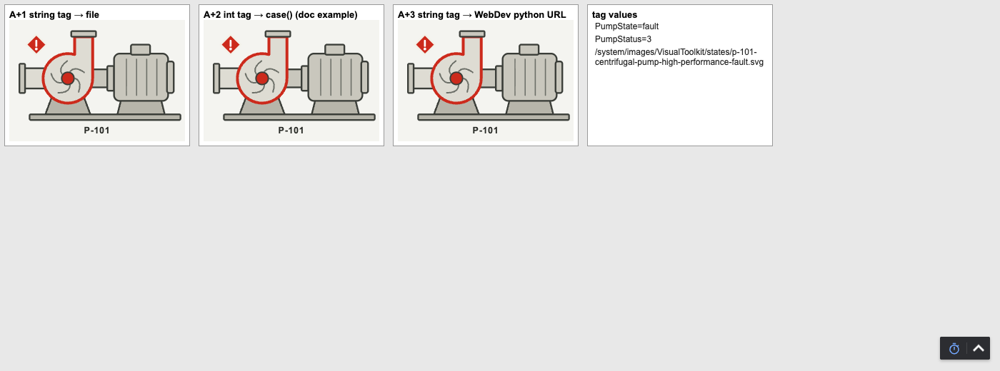
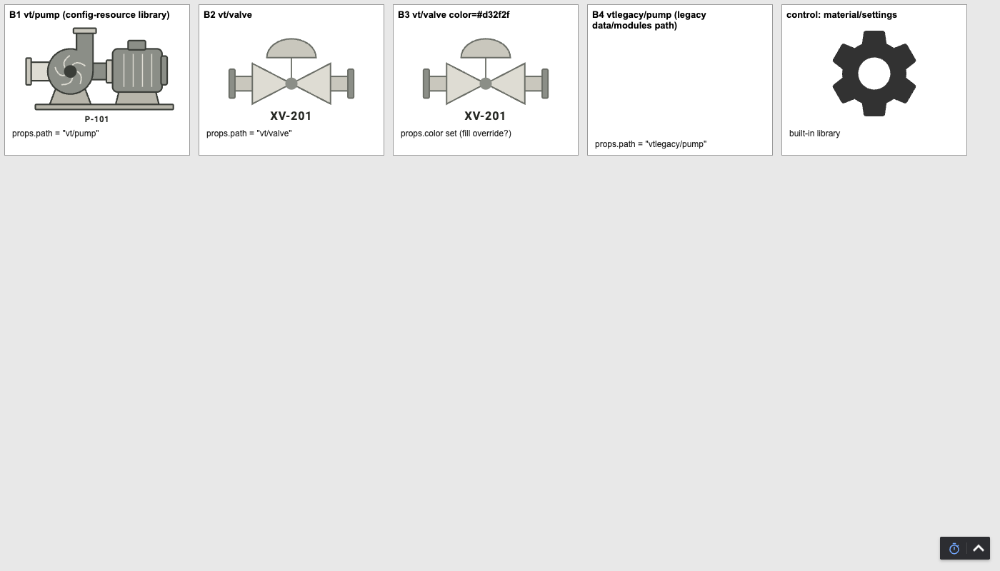
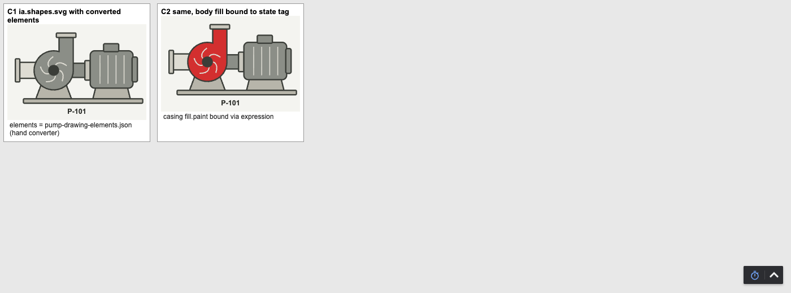
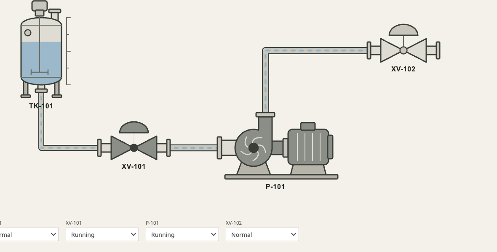
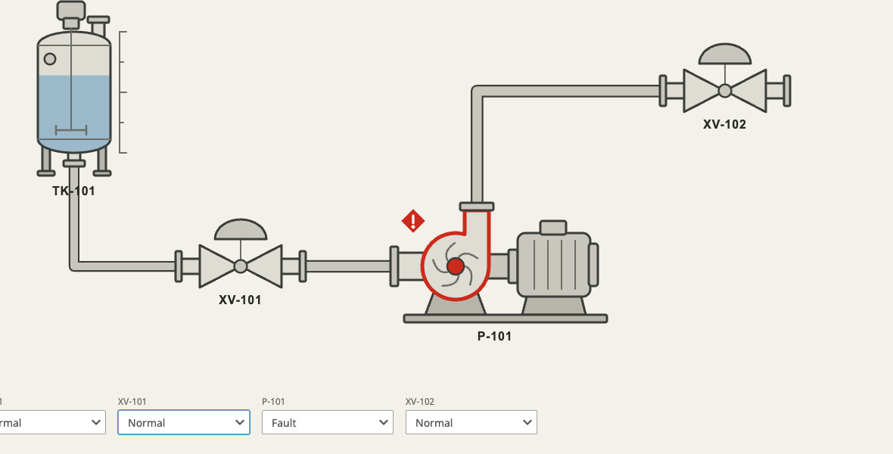

# Using Visual Toolkit assets in Ignition

Visual Toolkit creates the asset, and Ignition makes it operational. Ignition owns tags, bindings, alarming, navigation, security and events. These exports are visual content only.

> **Validation status (2026-09-30):** levels A, A+, B and C (2026-09-29), and the scene sample project, theme stylesheet and mono icons (2026-09-30), were tested on a fresh **Ignition 8.3.9** gateway (Docker, standard edition trial, Perspective session in headless Chrome). Results are below, with what failed. Nothing has been tested on 8.1 or in the Designer GUI, and those items stay *unverified*.

| Level | Export (`lib/`) | Workflow | Status on 8.3.9 |
| --- | --- | --- | --- |
| **A · Universal SVG** | `exportSvg` (**Download SVG**) | Image `props.source`: gateway image, data URI or WebDev python resource | **Verified**, CSS animation runs. WebDev *mounted folders* fail (wrong MIME type) |
| **A+ · State set** | `exportIgnitionKit` → `states/*.svg` | Bind the Image `source` to an expression over a status tag | **Verified**, swaps live as the tag changes |
| **B · Icon repository** | `exportIconRepository`, `exportIconRepositoryKit` | 8.3 config-resource folder; reference icons as `<library>/<id>` | **Verified** (colour and mono, 8.3 layout). Mono follows `props.style.color` or a style class, **not** `props.color`. 8.1 folder not read on a fresh 8.3 |
| **C · Drawing** | `exportPerspectiveDrawingSvg` | Drawing `props.elements`; bind `elements[n].fill.paint` | **Verified** through a script-converted `elements` array. Designer drag-and-drop *not tested*. Animation is lost |
| **D · Starter metadata** | `exportIgnitionMetadata` (`*.ignition.json` in the kit) | Suggested state names, region element ids and ports | Built (guidance only) |
| **Smart SVG** | `exportSmartSvg` | Expression rewrites `data-vt-state` inside a data URI | **Verified** (see below). Inline Frame and Markdown do not work |
| **Sample project** | `exportIgnitionSampleProject` (Mimics → **Ignition sample project**) | A Perspective project built from a composed scene, plus its memory tags | **Verified** when installed on the file system (see below). Gateway zip import, Designer tag import and 8.1 *unverified* |
| **E · Spatial** | `spatialGlb` | Dimension Engine module loads `vt.spatial/v0` models | Browser dev build only; not yet on a gateway |
| **Theme** | `exportPerspectiveThemeCss` | Paste `:root { --vt-* }` into the project's Advanced Stylesheet | **Verified**: variables reach component styles and inline icons; `.psc-vt-state-*` helpers work. Images can't see them |

| State set bound to a tag | Icon repository | Drawing with a bound fill |
| --- | --- | --- |
|  |  |  |

*Screenshots from the 8.3.9 test session. The grey casing colour in the Drawing test was picked by the tester, not by Visual Toolkit.*

## Getting SVGs onto the gateway (A)

Three ways worked; pick one.

1. **Gateway image management (no code).** Put the file at `data/config/resources/core/ignition/images/<Folder>/<file>.svg/<file>.svg`, with a `resource.json` beside it: `{"scope":"A","version":1,"restricted":false,"overridable":true,"files":["<file>.svg"],"attributes":{"width":156,"height":104,"format":"SVG","size":<bytes>}}`. Restart the gateway. Then use `props.source = "/system/images/<Folder>/<file>.svg"`. Uploading through the Designer's Image Management tool should produce the same resource, but that was not tested.
2. **Data URI.** `"data:image/svg+xml;base64,<b64>"`, or `"data:image/svg+xml;utf8," + encodeURIComponent(svg)`.
3. **WebDev python resource** returning `{"contentType": "image/svg+xml", ...}`.

**Don't** use a WebDev *mounted folder*: it serves SVG as `ignition-project/xml` with `nosniff`, so the Image silently shows nothing.

## State-set example (A+)

1. Export the **Ignition kit** and unzip it. `states/` holds one SVG per state.
2. Add the files as gateway images under `<Folder>/states/` (method 1 above).
3. On an Image component, bind `props.source` with an expression such as:

```
"/system/images/VisualToolkit/states/p-101-centrifugal-pump-high-performance-" +
  case({[default]Pumps/P101/Status}, 0, "normal", 1, "running", 2, "warning", 3, "fault",
       4, "maintenance", 5, "disabled", "comm-loss") + ".svg"
```

Tested with a memory tag written by `system.tag.writeBlocking`: running → fault → warning → comm-loss swapped live in one session, and an unmapped value fell through to comm-loss. If your tag already holds the state name, concatenate it directly. The mapping from tag values to states is yours to define. Visual Toolkit only suggests the state vocabulary.

## Smart SVG through an expression

`smart.svg` switches on the root `data-vt-state` attribute. A Perspective Image can't set that attribute, but an expression can rewrite it inside a data URI:

1. Put `encodeURIComponent(smartSvg)` in a custom property, for example `view.custom.smartEncoded`.
2. Bind `props.source`:

```
"data:image/svg+xml;utf8," + replace({view.custom.smartEncoded},
  "data-vt-state%3D%22running%22", "data-vt-state%3D%22" + {[default]Pumps/P101/State} + "%22")
```

The search text must match the state the file was exported with. What did **not** work: an Inline Frame shows only the default state, and Markdown (`escapeHtml=false`) strips `<style>` and shows `<title>`/`<metadata>` as text. As a plain static Image URL, smart.svg renders and animates its default state only.

## Icon repository (B)

### What the Ignition manual says

From [Images and Icons in Perspective (8.1)](https://www.docs.inductiveautomation.com/docs/8.1/ignition-modules/perspective/working-with-perspective-components/images-and-icons-in-perspective) and [the 8.3 page](https://www.docs.inductiveautomation.com/docs/8.3/ignition-modules/perspective/working-with-perspective-components/images-and-icons-in-perspective):

- A repository is **one SVG file** named `<repository name>.svg`.
- The root is `<svg xmlns="http://www.w3.org/2000/svg" xmlns:xlink="http://www.w3.org/1999/xlink">`. Each icon is a **child `<svg>`** with an `id` (the icon name) and a `viewBox` large enough to enclose the graphic. The documented form uses nested `<svg>` elements, not `<symbol>`.
- Icons are referenced as `repository/id`, for example `example/red-circle`.
- **8.1** location: `…/Ignition/data/modules/com.inductiveautomation.perspective/icons/<repository name>.svg`.
- **8.3** location: `…/Ignition/data/config/resources/core/com.inductiveautomation.perspective/icons/<repository name>.svg`. Put a `config.json` (`{"svgFileName": "example.svg"}`) and a `resource.json` (`scope "A"`, `version 1`, `restricted false`, `overridable true`, `files [config.json, example.svg]`, `attributes {}`) in the same directory.
- Restart the Designer to pick up new icons. On 8.3 you restart the Designer and Gateway, or you press **Scan File System** on the Gateway's Platform Overview page.
- Icon components take a `color` (the example sets `icon.color` to `#4747FF`). The manual's example shows one icon with no `fill`, which implies that unfilled shapes take the icon colour.

### What the exporter produces

`exportIconRepository(items, { library, style, theme, variant })` writes one `<library>.svg` in the documented form. It contains one child `<svg viewBox id>` per requested item: a whole family (`iconItemsForStates(vo)` gives all seven states) or several recipes (`iconItemsFromRecipes`). The default ids are `<kind>-<state>`, such as `centrifugal-pump-running`. Colliding ids get `-2`, `-3` and so on. Every id in the file is unique, because clip paths and patterns are namespaced as `<icon>--<name>`.

- `variant: "color"` produces resolved theme colours.
- `variant: "mono"` produces `currentColor` only, with `fill-opacity` steps so the form still reads in one colour. Colour it with `props.style.color` or a style class, not `props.color` (see **Icon colour** below).

`exportIconRepositoryKit` zips both variants like this:

```
ignition-8.1/<library>.svg, <library>-mono.svg
ignition-8.3/<library>/{<library>.svg, config.json, resource.json}
ignition-8.3/<library>-mono/{…}
icons.json   (id → recipe, state, style, theme)
README.txt   (install steps and verification status)
```

### Install (verified on 8.3.9)

1. **8.3:** copy the folder `ignition-8.3/<library>/` (with `config.json`, `<library>.svg` and `resource.json`) into `data/config/resources/core/com.inductiveautomation.perspective/icons/`, so each repository has its own sub-folder. Restart the gateway, or try **Scan File System** (a hot scan was not tested). The repository is then served at `/data/perspective/icons/<library>.svg`.
2. In a view, set an Icon's `props.path` to `<library>/<id>`, for example `vt/centrifugal-pump-fault`. Tested with `vt/pump` and `vt/valve`, which rendered in full colour.
3. **8.1** (*unverified*): copy `ignition-8.1/*.svg` into `data/modules/com.inductiveautomation.perspective/icons/`, then restart the Designer. On a **fresh 8.3** gateway this folder is not read: it returned 404, and the log said that migration failed because `icons.digest.json` was missing. It's only a one-time migration path on upgrade.

**Icon colour (tested on 8.3.9, 2026-09-30):**
- The colour variant ignores `props.color`, because VT shapes carry explicit fills.
- Perspective applies `props.color` as CSS `fill` on the icon's `<svg>`. The mono variant paints with `currentColor`, so `props.color` does **not** recolour it; it stays the default text grey.
- To colour a mono icon, set **`props.style.color`**, which you can bind to a state expression. A blue `style.color` turned every stroke and fill blue. Or add a state class from the theme stylesheet (`vt-state-fault` → `.psc-vt-state-fault`), which turned it the fault red.

## Drawing (C)

The [Drawing component](https://www.docs.inductiveautomation.com/docs/8.3/appendix/components/perspective-components/perspective-display-palette/perspective-drawing) (`ia.shapes.svg`) holds its shapes in `props.elements`. `exportPerspectiveDrawingSvg` removes what a Drawing can't carry: `<style>` blocks, CSS animation, `var()`, `<metadata>`, `<title>`, `class` and `data-*`. Paint uses presentation attributes only, and element ids equal the region ids (`casing`, `impeller`, `status-hub` …).

**Tested on 8.3.9:** a script converted the VT pump SVG into `elements` in 23 shapes. Groups became `{type:"group", elements}`, paths kept `d`, rect, circle, line and text kept their geometry, and colours became `fill:{paint}` / `stroke:{paint, width}`. Region ids survived, and `aria-label` became `name`. Binding `props.elements[n].fill.paint` to a tag expression turned the casing red on fault.

**Not tested:** the Designer's drag-and-drop import. It's a GUI action, and the docs say ids get a prefix, so check the ids after importing. Any Drawing loses VT's animation, `<title>` and `<metadata>`.

## Theme stylesheet

`exportPerspectiveThemeCss(theme)` writes `:root { --vt-*: … }` plus optional `.psc-vt-state-<state>` helper classes that set `color`/`fill` from the state token. The Perspective [Styles](https://www.docs.inductiveautomation.com/docs/8.1/ignition-modules/perspective/styles) docs say that **Enable Advanced Stylesheet** creates a `stylesheet.css` that accepts ordinary CSS, and that style classes are injected with a `.psc-` prefix.

**Tested on 8.3.9 (2026-09-30):** I placed the export as the project resource `com.inductiveautomation.perspective/stylesheet/stylesheet.css`, with a `resource.json` listing it, and restarted the gateway.
- `--vt-state-fault` resolved on `:root` in the session.
- A Label styled `color: var(--vt-state-fault)` and a Label with the style class `vt-state-fault` both rendered the fault red (`#cc2a1c`).
- A mono Icon with that class turned red too.

Enabling the stylesheet from the Designer should create the same resource, but that step itself was not tested. SVG shown through an **Image** (gateway URL or data URI) is a separate document, so it can't see these variables. Use exported colours there.

## Sample project from a scene

In **Mimics → Piping & connections**, **Ignition sample project (.zip)** turns the composed scene into a working Perspective project. `exportIgnitionSampleProject(scene, opts)` does the same in code (sample project v1).

- **One view, `VisualToolkit/<Scene>`**, mapped to the page `/`. Each item is an Image whose `props.source` is a `case()` expression over its tag, choosing one of seven state SVGs held as data URIs in `view.custom.vt.items`. Anything unmapped, including a missing tag, shows *comm-loss*.
- **Pipes are Images too.** Each one switches to its flowing variant while either end is *running*, the same rule the composer uses.
- **One String memory tag per item**, `[default]VisualToolkit/<Scene>/<label>/State`, holding a state name. A dropdown per item is bound bidirectionally to it, so the demo runs without a PLC.

```
README.txt, sample.json                      install steps; item → tag map
project/VisualToolkit_<Scene>/               copy into data/projects/
VisualToolkit_<Scene>.zip                    the same project, for Gateway → Projects → Import
tags/ignition-8.3/tag-definition/default/    copy VisualToolkit/ into data/config/resources/core/ignition/tag-definition/default/
tags/tags-import.json                        the same tags for the Designer Tag Browser
```

**Tested on 8.3.9 (2026-09-30)** with the demo transfer skid:
1. I copied `project/VisualToolkit_TransferSkid/` into `data/projects/` and `VisualToolkit/` into the default provider's `tag-definition` folder, then restarted the gateway. The project started, and the tag files survived the restart. The tag file format is what the gateway itself wrote after a `system.tag.configure` call.
2. An anonymous session at `/data/perspective/client/VisualToolkit_TransferSkid/` showed the skid in its saved states, with all seven images (four items, three pipes) loaded and the running pipes flowing.
3. Choosing *Fault* for P-101 and *Normal* for XV-101 in the dropdowns wrote the tags. The pump swapped to its fault symbol, the valve to normal, and every pipe stopped flowing. The values survived a restart.
4. After I pointed one binding at a missing tag, that item showed *comm-loss*.

| Running (as saved) | P-101 set to Fault from the dropdown |
| --- | --- |
|  |  |

**Not tested:** importing `VisualToolkit_<Scene>.zip` through the Gateway web UI, importing `tags-import.json` in the Designer, **Scan File System** instead of a restart, and Ignition 8.1.

To drive the view from real equipment, change the tag paths in the Image bindings. Or turn each memory tag into an expression tag that maps your status value to a state name.

This test also turned up a bug in the mimic SVG itself: nested symbols carried their `width`/`height` twice. Browsers accept that inline, but a standalone `.svg` (the mimic download, the scene kit and these data URIs) must be valid XML. It is fixed, and a test now guards it.

## Other platforms

See [EXPORTERS.md](EXPORTERS.md) for Siemens WinCC Unified and Rockwell FactoryTalk Optix.
